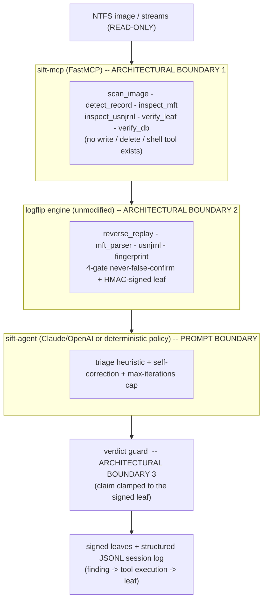
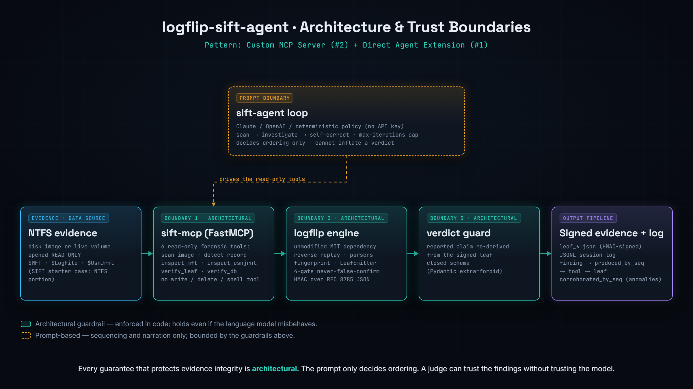

# logflip-sift-agent

> Autonomous NTFS anti-forensics triage for **Protocol SIFT**: a read-only MCP
> server and a self-correcting Claude agent built on the `logflip` detection
> engine. The agent finds timestomping on a disk image, reasons about each
> candidate, and self-corrects when the evidence does not add up - while a signed,
> never-false-confirm engine makes hallucinated findings structurally impossible.

**License: [MIT](LICENSE)** &nbsp;|&nbsp; SANS *FIND EVIL!* hackathon &nbsp;|&nbsp; Architecture: **Custom MCP Server (#2) + Direct Agent Extension (#1)**

---

## What it does

`logflip-sift-agent` turns the deterministic [`logflip`](https://github.com/javierdejesusda/logflip-closed)
engine (NTFS `$LogFile` reverse-replay timestomp detection, corroborated across
`$LogFile`, `$UsnJrnl`, and `$SI`-vs-`$FN`) into a fully autonomous incident-response agent:

- **Read-only MCP server** (`sift-mcp`) exposes the engine as typed forensic tools
  and nothing else. There is no write, delete, or shell tool, so the agent
  *physically cannot* modify or spoliate the evidence. The guarantee is
  architectural, not a prompt the model could ignore.
- **Self-correcting agent loop** (`sift-agent`) scans the image, investigates each
  record that disagrees with the journal, and on a single-source anomaly pivots to
  an independent corroboration channel before concluding. It accepts the engine's
  bounded verdict, including an honest "cannot confirm."
- **Signed audit trail**: every finding's verdict traces to the tool execution
  that derived it (`produced_by_seq`); a corroborated anomaly links the independent
  tools that corroborated it (`corroborated_by_seq`); and journaled findings carry
  an HMAC-signed evidence leaf a judge can re-verify offline.

It maps to Rob T. Lee's bar for Protocol SIFT directly: the AI directs verified
tools and self-corrects; it does not interpret raw bytes or decide verdicts.

## Architecture at a glance





Full write-up and the architectural-vs-prompt boundary table: [docs/ARCHITECTURE.md](docs/ARCHITECTURE.md).

## Quickstart (no API key, deterministic policy driver)

```bash
# 1. Install the engine (pre-existing component) and this agent.
pip install "git+https://github.com/javierdejesusda/logflip-closed"
pip install -e .            # from this repo root

# 2. Build the synthetic demo case (two journaled stomps + one anomaly).
python cases/demo_stomp/generate.py

# 3. Run the agent. It scans, investigates, and self-corrects on the anomaly.
python -m sift_agent --image cases/demo_stomp/case.img --usnjrnl-record 42 \
    --log logs/session.jsonl --leaf-dir cases/demo_stomp/leaves
```

Expected: records 5 and 7 report `provisional` (with signed leaves), record 12
reports `anomaly` (corroborated, then honestly not escalated). Exit code 2.
The full reasoning and tool trace is written to `logs/session.jsonl`.

A pre-generated sample trace (deterministic policy driver) is committed at
[`logs/sample_session.jsonl`](logs/sample_session.jsonl). A second sample from the
OpenAI driver, [`logs/sample_session_openai.jsonl`](logs/sample_session_openai.jsonl),
shows the same triage with per-turn token usage and the model's own reasoning.

## Try it out (Docker, one command)

```bash
docker compose up --build
```

This builds an image with the engine and the agent installed, generates the demo
case, runs the agent, and prints the triage report plus the session-log path.

## LLM-driven mode (real autonomous reasoning)

```bash
# Anthropic (Claude)
export ANTHROPIC_API_KEY=sk-ant-...
python -m sift_agent --image cases/demo_stomp/case.img --usnjrnl-record 42 \
    --driver claude --model claude-sonnet-4-6 --log logs/session.jsonl

# OpenAI
export OPENAI_API_KEY=sk-...
python -m sift_agent --image cases/demo_stomp/case.img --usnjrnl-record 42 \
    --driver openai --model gpt-4o --log logs/session.jsonl
```

Same tools, same guards; the model chooses the sequence and narrates its reasoning,
and each turn's token usage is recorded in the session log. A `.env` file holding
the key is auto-loaded. Without a key, the LLM drivers fall back to the
deterministic policy so the agent always runs for a judge.

## Repository layout

| Path | What |
|------|------|
| `sift_mcp/` | Read-only MCP server: `engine.py` (adapters), `server.py` (FastMCP surface) |
| `sift_agent/` | Agent loop (`orchestrator.py`), `guard.py`, `clients.py` (policy), `llm_client.py` (Claude), `llm_client_openai.py` (OpenAI), `session_log.py`, `tools.py`, `prompts.py`, `__main__.py` |
| `cases/demo_stomp/` | Synthetic case generator and sample outputs |
| `docs/` | Architecture, dataset, accuracy report, project description |
| `tests/` | 42 tests (read-only surface, guard, loop, self-correction, log, CLI, LLM drivers) |

## Evidence integrity (never-false-confirm)

A `confirmed` verdict requires all four engine gates to pass simultaneously
(complete `$LogFile` inversion, a signed fingerprint match at >= 0.85 confidence,
and two independent failure-mode classes), a real engagement key, and a signed
fingerprint DB. The demo key cannot produce a confirmed leaf by construction, so
the demo's honest ceiling is `provisional`. Anomalies (no `$LogFile` coverage) can
never be confirmed. See [docs/ACCURACY_REPORT.md](docs/ACCURACY_REPORT.md).

## Tests

```bash
python -m pytest tests/ -q      # 42 agent/MCP tests
```

The underlying engine ships its own 809-test suite (run from the `logflip-closed`
checkout).

## Documentation

- [Architecture and trust boundaries](docs/ARCHITECTURE.md)
- [Project description](docs/PROJECT_DESCRIPTION.md)
- [Dataset documentation](docs/DATASET.md)
- [Accuracy report](docs/ACCURACY_REPORT.md)

## License

MIT. The `logflip` engine is a separate, pre-existing MIT component reused here;
the novel contribution of this repository is the autonomous MCP agent, the verdict
guard, the self-correction loop, and the signed session log.
