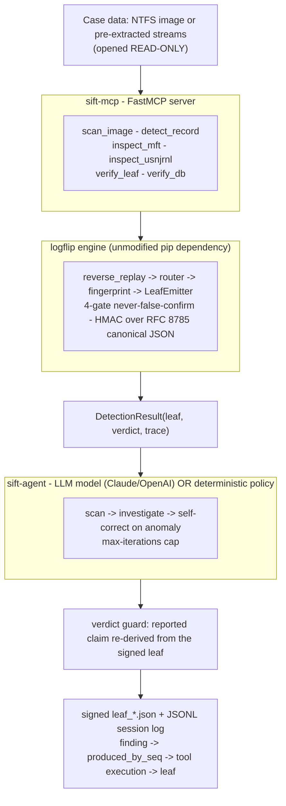

# Architecture and Trust Boundaries

## Architectural pattern

This submission combines two of the hackathon's supported patterns:

- **Custom MCP Server (#2)** - `sift-mcp` exposes the `logflip` engine as typed,
  read-only functions instead of generic shell access. The agent cannot run a
  destructive command because the server does not expose one.
- **Direct Agent Extension (#1)** - `sift-agent` is an LLM-driven loop (Claude or
  OpenAI, with a deterministic policy fallback) that sequences those tools and
  self-corrects.

The engine, `logflip`, is a pre-existing MIT component and is not modified.

## Component diagram



## Data flow

1. The agent (Claude or policy) calls `scan_image`, which runs `logflip`'s
   `scan_detection` over a read-only `ImageFileSource` and returns each candidate
   record's verdict.
2. For a record that disagrees with the journal, the agent calls `detect_record`
   (`run_detection`), which reverse-replays the `$LogFile`, routes on byte
   disagreement, fingerprints, and emits an HMAC-signed leaf with a derived
   verdict (`clean` / `provisional` / `confirmed`).
3. For a single-source `anomaly` (an `$SI`-vs-`$FN` delta with no `$LogFile`
   coverage), the agent self-corrects: it calls `inspect_usnjrnl` and
   `inspect_mft` to corroborate across an independent failure-mode class, then
   reports honestly without escalating past what the engine supports.
4. The verdict guard re-derives every reported finding from the signed leaf, and
   the session log records each step so a finding's verdict traces to the tool
   execution that derived it, and a corroborated anomaly additionally links the
   independent tools that corroborated it.

## Security boundaries: architectural vs prompt-based

The hackathon asks for these to be distinguished explicitly. They are:

| Guarantee | Type | Where it is enforced | Survives a misbehaving model? |
|-----------|------|----------------------|-------------------------------|
| No evidence mutation or spoliation | **Architectural** | `sift-mcp` registers only read-only tools; sources open read-only. A `test_mcp_server` test asserts the registered surface contains no write/delete/exec/shell tool. | Yes |
| No false `confirmed` | **Architectural** | `logflip` four-gate invariant + demo-key block; the verdict guard re-derives the claim from the signed leaf (`sift_agent/guard.py`). | Yes |
| Closed result schema (no smuggled verdict) | **Architectural** | Pydantic `extra="forbid"` on the `Leaf` model and tool envelopes. | Yes |
| No runaway loop | **Architectural** | `max_iterations` cap in `orchestrator.triage_image`, not a prompt request. | Yes |
| Tamper-evident evidence | **Architectural** | HMAC over RFC 8785 canonical JSON per leaf; offline re-verification via `verify_leaf`. | Yes |
| Triage sequencing and "what to look at next" | **Prompt** | The system prompt in `sift_agent/prompts.py` (or the deterministic policy). | No - bounded by the guards above |
| Narrative honesty and disclaimers | **Prompt + Architectural** | The prompt asks for honesty; the guard and the closed schema enforce the structured claim regardless. | The structured claim: yes |

The key property: every guarantee that protects evidence integrity or finding
accuracy is **architectural**. The prompt layer only decides ordering and
narration, and even there the verdict guard clamps the structured output. A judge
can therefore trust the findings without trusting the model.

## Traceability

Each session-log line carries a monotonic `seq` and an ISO-8601 `ts`. A `tool`
line records the call and a digest of its raw output. A `finding` line records
`produced_by_seq` (the tool execution whose output derived the verdict) and, for a
corroborated anomaly, `corroborated_by_seq` (the independent inspect tools that
corroborated it). When journaled it also records a `leaf_ref` to the signed
evidence leaf; anomalies carry `leaf_ref: null` because they are never confirmed
and produce no leaf. Example (from the committed sample):

```
seq 7  reasoning  "Record 12 is a single-source anomaly ... do not over-claim."
seq 8  tool       inspect_usnjrnl(file_ref=12)
seq 9  tool       inspect_mft(mft_record=12)
seq 13 finding    record 12 -> anomaly, produced_by_seq=2 (scan),
                  corroborated_by_seq=[8,9], leaf_ref=null
```

The verdict tier (`anomaly`) comes from the scan; the corroboration evidence comes
from seq 8 and 9. The two links are recorded separately so the trace never implies
the scan alone produced the corroborated finding.
